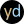
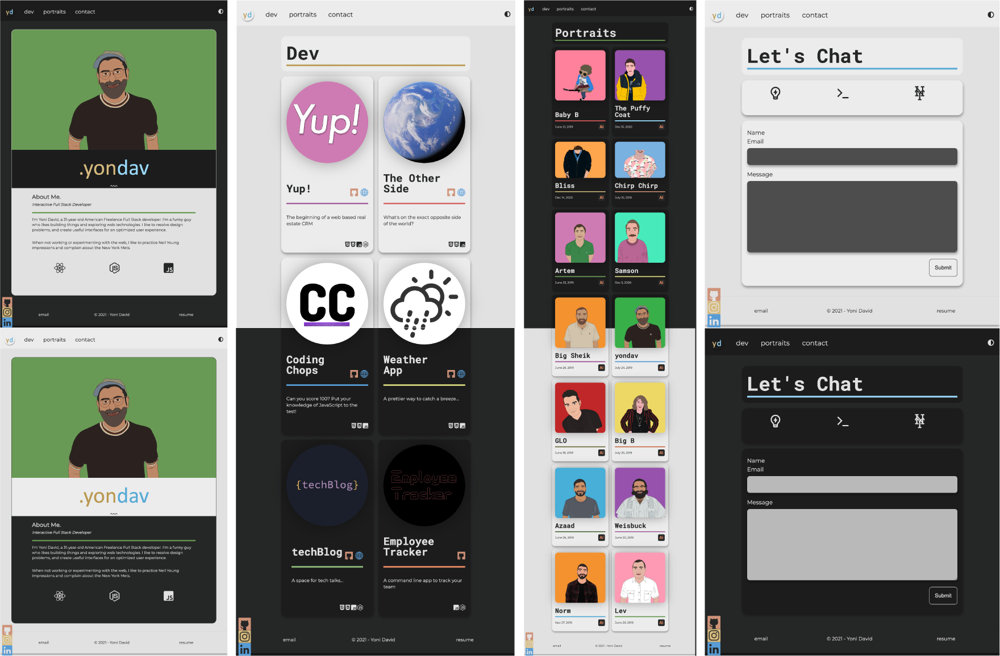
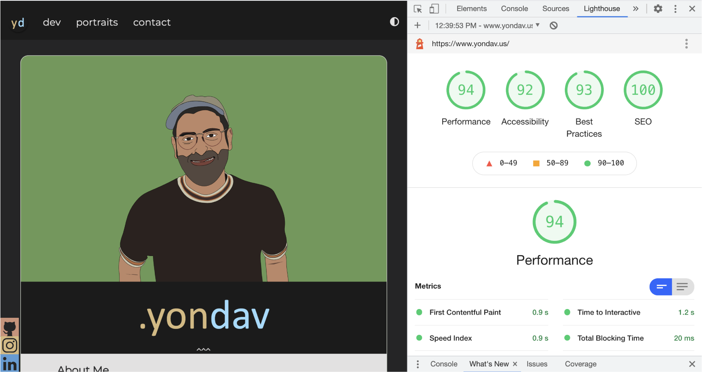

# yondav/ 20-react-portfolio

[](https://opensource.org/licenses/MIT)

<div align="center">
  <a href="https://yondav.us" alt"deployed">
    
  </a>
  <div>
    <a href="https://github.com/yondav/20-react-portfolio" alt"repo">
      
      <p align=left>&nbsp;&nbsp;Repo</p>
    </a>
  </div>
</div>

---

## About / Synopsis

<br />
<div align="center">
I'm Yoni David, a 31-year-old American Freelance Full Stack developer. I'm a funky guy who likes building things and exploring web technologies. I like to resolve design problems, and create useful interfaces for an optimized user experience.

When not working or experimenting with the web, I like to practice Neil Young impressions and complain about the New York Mets and this is my portfolio.

</div>

---

## Table of Contents

<br/>

> - [Title / Repository Name](#title--repository-name)
>   - [About / Synopsis](#about--synopsis)
>   - [Table of Contents](#table-of-contents)
>   - [Installation](#installation)
>   - [Usage](#usage)
>   - [Demo](#demo)
>   - [Author](#author)
>     - [Contact](#contact)
>   - [Contributing / Issues](#contributing--issues)
>     - [Contributing](#contributing)
>     - [Reporting Issues](#reporting-issues)
>   - [License](#licenses)

---

## Installation

<br />

Should you decide to clone the repo, you will have to install dependencies in the `root` directory and inside the `portfolio` directory.

```
npm i
```

In order to use [nodemailer](https://nodemailer.com/about/) you'll need to configure the `.env.EXAMPLE` file in the `root` directory.

```
EMAIL=<your email>
WORD=<your password>
OAUTH_CLIENTID=<your OAUTH client id>
OAUTH_CLIENT_SECRET=<your OAUTH client secret>
OAUTH_REFRESH_TOKEN=<your OAUTH refresh token>
```

---

## Usage

<br />

Once all dependencies are installed, you will be able to run the react app from the server side by running `npm start` in the `root` directory.

---

## Demo

<br />

<div align="center">
  
</div>

<br />

<div align="center">
  
  
  
</div>

<br />

<div align="center">
  
</div>

<br/>

---

## Author

<br />

### Yoni David

<br />

- <a href="https://yondav.us/">Portfolio</a>
- <a href="https://github.com/yondav">Github</a>

<br />

---

### Contact

Inquiries can be sent to [yoni@yondav.com](mailto:yoni@yondav.com)

## Contributing / Issues

<br />

### Contributing

<br />

- Fork repo
- Make additions and changes on new, personalized branch
- Submit [pull request](https://github.com/yondav/20-react-portfolio/pulls)

---

<br />

### Reporting Issues

<br />

Report issues by selecting the [issues](https://github.com/yondav/20-react-portfolio/issues) tab and creating a new issue

---

<br />

## Licenses

<br />

- [MIT](https://github.com/yondav/13-e-commerce-back-end/blob/main/LICENSE)

---

<div align="center">
  
  
  
  
  
  <p>This README file was built with 
    <a href="https://github.com/yondav/README-gen-09">README GENERATOR</a>
  </p>
  <p>Copyright &copy; 2021, Yoni David<p>
</div>
